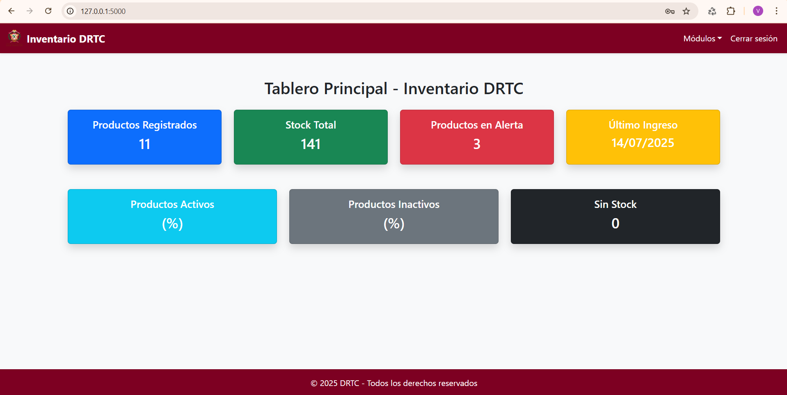

# 📦 Sistema Web de Inventario DRTC

Sistema web desarrollado en **Flask + PostgreSQL** para la **Dirección Regional de Transportes y Comunicaciones (DRTC)**, orientado a la **gestión de inventario de tóneres y tintas** institucionales, con control de ingresos, salidas, productos, reportes y panel de indicadores.

---

## 🚀 Características Principales
- **Autenticación de usuarios** con roles y permisos.
- **Módulo de Productos**: registro, edición, eliminación y control de stock.
- **Módulo de Ingresos**: registro de entradas de productos con actualización automática de stock.
- **Módulo de Salidas**: registro de salidas con validación de stock disponible.
- **Reportes PDF y Excel** con filtros y diseño optimizado.
- **Dashboard visual** con indicadores y gráficos interactivos (Chart.js).
- **Diseño responsive** para escritorio y dispositivos móviles.
- **Control de usuarios** y trazabilidad de acciones.
- **Base de datos en PostgreSQL** con integridad referencial.

---

## 🛠 Tecnologías Utilizadas
- **Backend**: Flask (Python)
- **Base de Datos**: PostgreSQL
- **Frontend**: HTML5, CSS3, Bootstrap 5, JavaScript, DataTables, Chart.js
- **Reportes**: FPDF, ReportLab, Pandas, XlsxWriter, OpenPyXL, xhtml2pdf
- **Control de versiones**: Git/GitHub

---


## 🖼 Capturas de Pantalla

### Pantalla de Inicio de Sesión


### Panel Principal (Dashboard)



## 📂 Estructura del Proyecto

drtc_inventario/
│── app/
│ ├── init.py
│ ├── models.py
│ ├── routes/
│ ├── templates/
│ ├── static/
│── migrations/
│── requirements.txt
│── run.py
│── README.md
│── .env (configuración local)
│── docs/


---

## ⚙ Instalación y Configuración

### 1️⃣ Clonar repositorio
```bash
git clone https://github.com/pevalvictor/drtc_Tinta_Toner.git
cd drtc_Tinta_Toner


### CREACION DEL ENTORNO VIRTUAL

python -m venv venv
source venv/bin/activate    # En Linux/Mac
venv\Scripts\activate       # En Windows

### INSTALACION DE DEPENDECIAS

pip install -r requirements.txt


###EJECUTAR MIGRACIONES
flask db init
flask db migrate
flask db upgrade


###EJECUTAR SERVIDOR

python run.py
